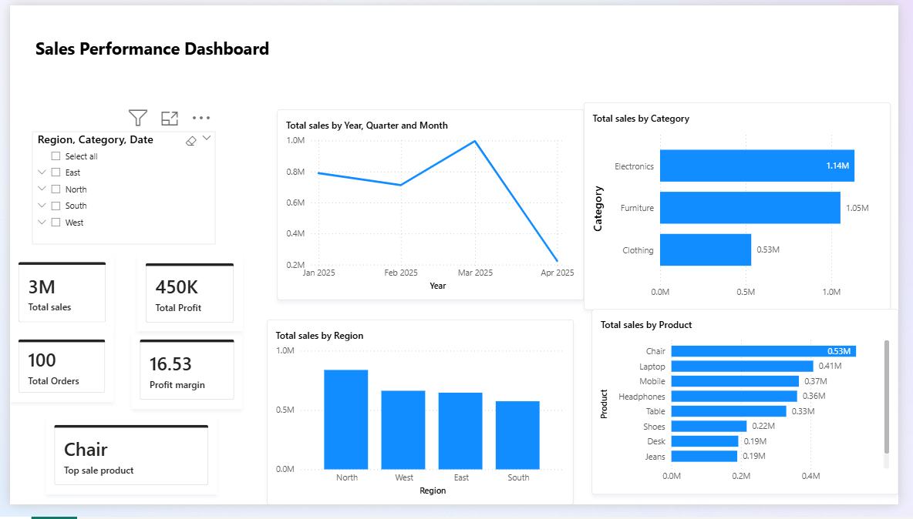

# Sales Performance Dashboard - Power BI

## Project Overview
This project analyzes sales performance using Microsoft Power BI.

The dashboard provides insights into:
- Total Sales
- Total Profit
- Total Orders
- Profit Margin
- Sales by Category
- Sales by Region
- Sales by Product
- Monthly Sales Trend

## Dashboard Preview

## Business Problem

Businesses need to monitor sales performance across different regions and product categories to identify profitable areas and improve decision-making.

## Dataset

The dataset contains:
- Region
- Category
- Product
- Sales
- Profit
- Order Date

## Power BI Features Used

- Power Query
- Data Cleaning
- DAX Measures
- KPI Cards
- Bar Charts
- Line Charts
- Slicers
- Interactive Dashboard

## Key Insights

- Total Sales: 3M
- Total Profit: 450K
- Total Orders: 100
- Electronics category generated the highest sales.
- North region recorded the highest sales.
- Chair was the top-selling product.

## Tools Used

- Microsoft Power BI
- Excel
- Data Visualization
- DAX

## Project Files

- Sales_Performance_Dashboard.pbix
- Sales_dashboard.png
- Dataset

## Author

Anil Kumar
